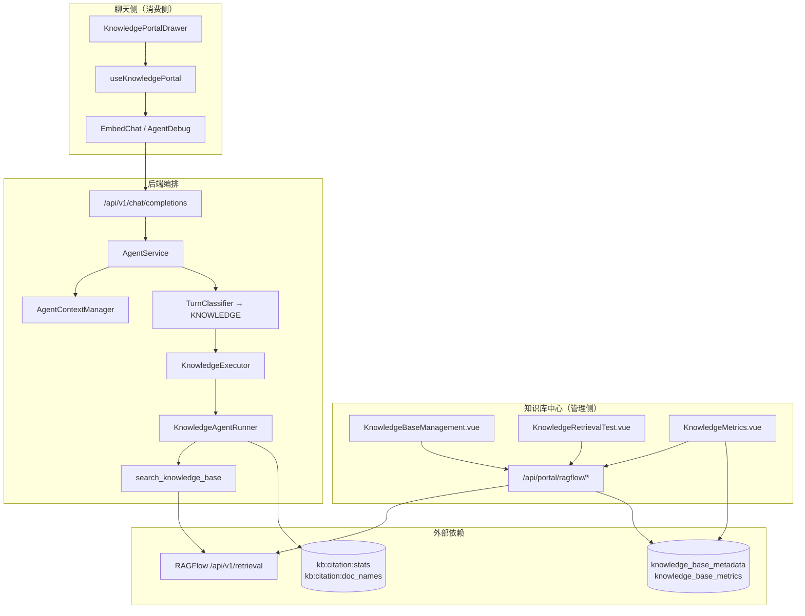
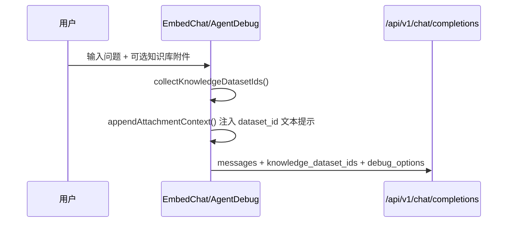
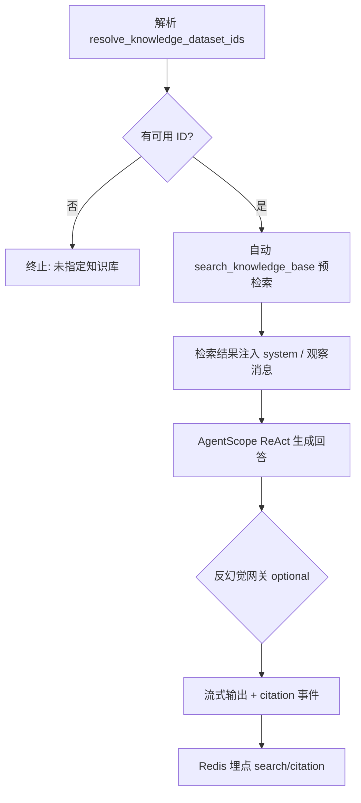

# 知识库中心与基于知识库聊天 — 架构设计

本文档描述云枢智能体平台中 **知识库开发中心（管理侧）** 与 **基于知识库的聊天问答（消费侧）** 的端到端架构，以当前代码为准。

| 关联文档 | 说明 |
|----------|------|
| [chat/CHAT_FLOW.md](./chat/CHAT_FLOW.md) | 通用对话主链路、Executor/Runner 分工 |
| [chat/PROMPT_LAYERS.md](./chat/PROMPT_LAYERS.md) | 知识库附件注入、提示词分层 |
| [permission_design.md](./permission_design.md) | RBAC、`resource_type=dataset` 权限 |
| [AGENTSCOPE_RUNTIME.md](./AGENTSCOPE_RUNTIME.md) | KnowledgeAgentRunner 运行时 |
| [openspec/specs/knowledge-platform/spec.md](../../openspec/specs/knowledge-platform/spec.md) | 知识库平台需求规格 |
| [../api-schemal/ragflow-api.md](../api-schemal/ragflow-api.md) | RAGFlow 原生 API 参考 |

*文档版本：2026-07-08*

---

## 1. 范围与术语

### 1.1 范围

| 模块 | 说明 |
|------|------|
| **知识库中心** | 控制台内知识库 CRUD、文档管理、检索测试、运营分析 |
| **知识库门户** | 聊天页侧边抽屉，用户勾选本轮要检索的知识库 |
| **知识库聊天** | 路由到 `KnowledgeExecutor` → 自动 RAG 检索 → 带引用回答 |
| **运营埋点** | 检索/引用行为统计，Redis → MySQL 落库 |

### 1.2 核心术语

| 术语 | 含义 |
|------|------|
| **RAGFlow `dataset_id`** | RAGFlow 知识库 ID，32 位 hex 字符串；**检索与权限的唯一业务主键** |
| **本地元数据** | `knowledge_base_metadata` 表，存平台侧名称、标签、归属等，与 RAGFlow Dataset 1:1 |
| **显式选库** | 用户在聊天窗口通过知识库门户勾选，产生 `knowledge_dataset_ids` |
| **智能体绑定** | `engine_config.dataset_ids`，智能体管理后台配置 |
| **系统默认库** | 系统配置 `knowledge_ragflow_dataset_ids`，作为非强制场景兜底 |

---

## 2. 系统架构总览



**设计原则：**

- **存储分离**：文档内容与向量在 RAGFlow；平台只维护扩展元数据、权限、审计与运营指标。
- **检索专用配置**：知识库问答使用 `knowledge_ragflow_*` 配置前缀，与 ChatBI 元数据 RAG 配置隔离。
- **自动预检索**：`KnowledgeAgentRunner` 在 ReAct 前平台侧自动调用 `search_knowledge_base`，不依赖模型自觉调工具。

---

## 3. 知识库中心（管理侧）

### 3.1 前端页面与路由

| 路由 | 页面 | 菜单权限 | 职责 |
|------|------|----------|------|
| `/dashboard/knowledge-bases` | `KnowledgeBaseManagement.vue` | `menu:knowledge_management` | 知识库列表、创建、元数据、文档树、上传/解析/删除 |
| `/dashboard/knowledge-retrieval-test` | `KnowledgeRetrievalTest.vue` | `menu:knowledge_retrieval_test` | 管理员/开发者检索调试 |
| `/dashboard/knowledge-metrics` | `KnowledgeMetrics.vue` | `menu:knowledge_management` | 运营分析看板 |

系统配置入口：`SystemConfig.vue` 中 **知识库设置** 分组（`knowledge_ragflow_*`、`knowledge_base_enabled`）。

### 3.2 后端 Portal API（`app/api/portal/endpoints/ragflow.py`）

| 方法 | 路径 | 说明 |
|------|------|------|
| GET | `/config` | RAGFlow 连接状态摘要 |
| GET | `/datasets` | 列表（合并本地元数据 + RAGFlow） |
| POST | `/datasets/sync` | 从 RAGFlow 同步并 upsert 本地元数据 |
| POST | `/datasets` | 创建知识库 |
| PUT | `/datasets/{id}/metadata` | 更新本地扩展元数据 |
| DELETE | `/datasets` | 删除知识库 |
| GET/POST/DELETE | `/datasets/{id}/documents/*` | 文档列表、上传、删除、解析 |
| GET | `/datasets/{id}/documents/{doc_id}/chunks` | Chunk 明细（需写权限） |
| GET | `/datasets/{id}/documents/{doc_id}/file` | 原档下载/预览 |
| POST | `/retrieval-test` | 检索测试（直连 RAGFlow） |
| GET | `/datasets/{id}/portal` | 知识库门户推荐提问 |
| GET | `/datasets/{id}/documents/{doc_id}/portal` | 文档级推荐提问 |
| GET | `/metrics/summary` | 运营指标汇总 |
| GET | `/datasets/{id}/permissions` | 知识库授权用户/角色 |

所有写操作经 `require_dataset_access` / `require_dataset_write_access` 与元素级权限（`element:knowledge:*`）校验，并写审计日志。

### 3.3 本地元数据 vs RAGFlow

```
RAGFlow Dataset (物理存储)
    id  = ragflow_dataset_id  ← 检索、权限、聊天传参均用此 ID
    name, description, chunks...

knowledge_base_metadata (平台扩展)
    ragflow_dataset_id  (唯一索引)
    name, description, owner, tags, notes, visibility, status, created_by ...
```

- 列表接口由 `KnowledgeBaseMetadataService.merge_with_ragflow()` 合并两侧数据。
- RAGFlow 有而本地无 → 展示为活跃知识库；本地有而 RAGFlow 无 → `status=missing`。
- 运营分析中的知识库中文名：优先本地元数据 → Redis 缓存 → RAGFlow 列表回退。

### 3.4 权限模型（知识库资源）

`PermissionService.get_knowledge_base_access()` 口径：

| 角色 | 可访问范围 | 可写范围 |
|------|------------|----------|
| 管理员 | 全部 | 全部 |
| 普通用户 | 角色/用户直连 `permissions.datasets` ∪ 自己创建的 ∪ 系统默认公开库 | 仅自己创建的 |

菜单权限（`menu:knowledge_management`）与数据权限（`resource_type=dataset`）**分离**：有菜单不等于能检索所有库。

---

## 4. 知识库门户（聊天侧选库）

### 4.1 组件与状态

| 文件 | 职责 |
|------|------|
| `KnowledgePortalDrawer.vue` | 侧边抽屉 UI：知识库卡片、文档树、推荐提问、高级检索参数 |
| `useKnowledgePortal.ts` | 数据集加载、钉住/偏好、激活 ID 与输入框附件同步 |
| `ChatInput.vue` | 展示 `knowledge_base` 类型附件胶囊 |

### 4.2 用户勾选 → 输入框附件

用户在门户中 toggle 知识库开关时：

```typescript
// useKnowledgePortal.ts
{
  type: "knowledge_base",
  url: currentIds.join(","),           // 一个或多个 dataset_id，逗号拼接
  filename: `已选择 ${n} 个知识库`,
}
```

写入 `chatInputRef.uploadedFiles`，成为本轮「显式选库」的载体。

### 4.3 门户能力摘要

- **钉住 / 提问后不关闭**：偏好持久化到 `portal-prefs`（`pinned_kb_dataset_ids` 等）。
- **推荐提问**：`GET /datasets/{id}/portal`，支持换一批（`exclude` 参数 + 随机抽样文档名）。
- **文档级提问**：展开文档后 `GET .../documents/{doc_id}/portal`。
- **高级参数**（存 localStorage，经 `debug_options` 传入后端）：
  - `knowledge_ragflow_similarity_threshold`
  - `knowledge_ragflow_vector_weight`
  - `knowledge_ragflow_metadata_top_k`
- **反幻觉开关**：`hallucination_check`（NLI 事实一致性网关，默认关）。

---

## 5. 基于知识库的聊天链路

### 5.1 前端发消息



**双通道传递 dataset ID：**

| 通道 | 字段 | 说明 |
|------|------|------|
| 结构化 | `knowledge_dataset_ids: string[]` | 优先口径；来自附件 + 历史 user 消息 |
| 文本提示 | user 消息 `---` 后附加 | 要求模型调用 `search_knowledge_base`，含 `dataset_id：xxx` |

```typescript
// EmbedChat.vue — 收集 ID（含追问继承）
collectKnowledgeDatasetIds()  // 当前 uploadedFiles + 历史 messages.files

// 注入文本（与结构化并行）
`用户本轮已选择知识库，dataset_id：${file.url}。你必须...调用 search_knowledge_base...`
```

### 5.2 API 入口

`ChatCompletionRequest.knowledge_dataset_ids`（`app/api/v1/endpoints/chat.py`）：

```python
knowledge_dataset_ids: Optional[List[str]]  # 本轮结构化指定的 RAGFlow dataset ID 列表
```

`AgentService` 合并：

```python
request_knowledge_dataset_ids = merge_request_knowledge_dataset_ids(
    knowledge_dataset_ids,   # API 字段
    messages,                # 历史 knowledge_base 附件
)
```

### 5.3 执行上下文：dataset ID 解析规则

`AgentContextManager.setup_context()` 决定本轮 `AgentContext.dataset_ids`：

```
① 若 request_knowledge_dataset_ids 非空
      → effective_dataset_ids = 用户显式选择（最高优先级）

② 否则
      → agent_dataset_ids = engine_config.dataset_ids（智能体绑定）
      → user_permitted_ids = 当前用户可访问的知识库集合
      → effective_dataset_ids = merge(agent_dataset_ids, user_permitted_ids)
```

**用户可访问集合**（`user_permitted_ids`）包含：

- 角色/用户直连授权的 `permissions.datasets`
- 自己创建的知识库（`knowledge_base_metadata.created_by`）
- 系统配置 `knowledge_ragflow_dataset_ids`（默认公开兜底）

写入上下文：

```python
AgentContext(
    dataset_ids=effective_dataset_ids,           # 本轮实际检索范围
    knowledge_dataset_ids=request_dataset_ids,     # 仅用户显式选择部分
    require_explicit_dataset=...,                  # KNOWLEDGE 轮次为 True
)
```

### 5.4 检索前二次解析：`resolve_knowledge_dataset_ids`

工具调用或自动预检索时，`knowledge_utils.resolve_knowledge_dataset_ids()` 合并：

| 优先级（合并去重） | 来源 |
|--------------------|------|
| 1 | 工具参数 `dataset_ids`（模型手动传入时） |
| 2 | `ctx.knowledge_dataset_ids`（请求结构化字段） |
| 3 | `ctx.dataset_ids`（上下文有效 ID） |
| 4 | 用户消息文本中的 `dataset_id：` 提示 |

**解析后：**

| 条件 | 行为 |
|------|------|
| `bound_ids` 非空 | 继续；非 admin 经 `filter_knowledge_dataset_ids` 过滤 |
| `bound_ids` 为空 且 `require_explicit_dataset=True` | 返回错误，**不使用**系统默认库 |
| `bound_ids` 为空 且未强制 | 回落 `knowledge_ragflow_dataset_ids` |

### 5.5 场景对照表

| 场景 | 显式选库 | 智能体绑定 | KNOWLEDGE 轮次 | 实际检索 ID |
|------|----------|------------|----------------|-------------|
| 门户勾选 1 个库 | ✅ | 任意 | ✅ | 仅勾选的库 |
| 未勾选，智能体绑定了 A | ❌ | A | ✅ | A（若在用户权限内） |
| 未勾选未绑定，普通助手轮次 | ❌ | ❌ | ❌ | 用户权限库 ∪ 系统默认库 |
| 未勾选未绑定，知识库轮次 | ❌ | ❌ | ✅ | **报错终止** |

> **结论（与产品口径对齐）**  
> - **显式选了** → 用显式的。  
> - **没显式选** → 用智能体绑定 + 用户有权限的库（含分配给自己的、自己创建的、系统默认公开）；**不是**简单等于「全部有权限库」。  
> - **知识库专属轮次**且无显式选、无智能体绑定时，不允许回落系统默认。

### 5.6 轮次分类与 Executor 路由

`TurnClassifier` 判定 `TurnType.KNOWLEDGE` 的条件（满足其一）：

- 请求携带 `knowledge_dataset_ids`
- 智能体 `capabilities` 含 `knowledge_base` 且 `engine_config.dataset_ids` 非空
- 启发式 `looks_like_knowledge_query(q)`

路由：

```
AgentService → Dispatcher → KnowledgeExecutor → KnowledgeAgentRunner
```

`KNOWLEDGE` 轮次额外执行：

```python
agent_config = await AgentContextManager.enrich_for_knowledge_turn(...)
await AgentContextManager.setup_context(..., require_explicit_dataset=True)
```

### 5.7 自动预检索与回答生成

`KnowledgeAgentRunner.execute()` 主流程：



**`search_knowledge_base` 工具**（`app/services/ai/tools/knowledge_tool.py`）：

1. `resolve_knowledge_dataset_ids` + 权限过滤
2. `resolve_rag_retrieval_params`（系统配置 ← 智能体配置 ← `debug_options`）
3. `RagFlowClient.retrieve()` → `POST /api/v1/retrieval`

返回 JSON：

```json
{
  "content": "供 LLM 阅读的检索摘要（含 [ID:n] 指引）",
  "citations": [ { "id": "1", "doc_name", "content", "similarity", "doc_id", "dataset_id", ... } ]
}
```

### 5.8 RAGFlow 检索请求体

```python
# app/services/ai/ragflow_client.py
{
    "question": query,
    "dataset_ids": ["32位hex", ...],   # 核心：限定检索范围
    "top_k": 5,
    "page_size": top_k * 3,
    "similarity_threshold": 0.2,
    "vector_similarity_weight": 0.3
}
```

配置前缀：`knowledge_ragflow`（`ConfigService` category=`knowledge`）。

---

## 6. 引用、原档预览与埋点

### 6.1 引用格式

- 规范：`[ID:n]`（n 为检索结果序号，从 1 开始）
- 兼容旧式：`[n]`（逐步废弃）
- 前端 `CitationPopover` 展示片段；桌面端可「查看原档」，移动端隐藏

### 6.2 原档预览抽屉

`RagPreviewDrawer.vue`（`AgentDebug` / `EmbedChat` 共用）：

| 区域 | 内容 |
|------|------|
| 原档预览 | PDF → iframe；Office → 提示下载 |
| 被引用原文段落 | 检索 chunk HTML |
| 交互 | 两块均支持折叠；折叠一侧则另一侧占满剩余高度 |

原档 URL：`/api/portal/ragflow/datasets/{dataset_id}/documents/{doc_id}/file`

### 6.3 运营埋点

| 阶段 | 存储 | 说明 |
|------|------|------|
| 实时 | Redis `kb:citation:stats:{date}:dataset|document:search|citation` | 每次回答通过后 `HINCRBY` |
| 名称缓存 | Redis `kb:citation:doc_names`、`kb:citation:dataset_names` | 文档名 / 知识库名 |
| 落库 | `knowledge_base_metrics` 表 | 分钟级任务 + 看板刷新时同步 |
| 展示 | `KnowledgeMetrics.vue` | 趋势、排行榜、活跃文献源 |

埋点位置：`KnowledgeAgentRunner` 回答通过幻觉网关后，解析 `[ID:n]` 与 `prefetched_citations_raw` 对比。

---

## 7. 系统配置清单

| Key | 默认值 | 说明 |
|-----|--------|------|
| `knowledge_base_enabled` | `true` | 总开关；关闭后 `search_knowledge_base` 直接报错 |
| `knowledge_ragflow_api_url` | — | RAGFlow 网关地址 |
| `knowledge_ragflow_api_key` | — | API Key（secret） |
| `knowledge_ragflow_dataset_ids` | — | 默认公开知识库 ID，逗号分隔 |
| `knowledge_ragflow_metadata_top_k` | `5` | 召回 chunk 数 |
| `knowledge_ragflow_similarity_threshold` | `0.2` | 相似度阈值 |
| `knowledge_ragflow_vector_weight` | `0.3` | 向量权重（余下为全文） |

智能体级覆盖：`engine_config.dataset_ids`、`ragflow_similarity_threshold`、`top_k` 等。

---

## 8. 数据库表

| 表 | 用途 |
|----|------|
| `knowledge_base_metadata` | 本地知识库扩展元数据，`ragflow_dataset_id` 唯一 |
| `knowledge_base_metrics` | 按日、按 dataset/document 维度的 search/citation 计数 |

迁移脚本：`db-prod/V58-create_knowledge_base_metadata.sql`、`V77-add_knowledge_ragflow_configs.sql`、`V93-create_knowledge_base_metrics.sql`。

---

## 9. 代码入口速查

### 9.1 前端

| 路径 | 说明 |
|------|------|
| `frontend/src/views/KnowledgeBaseManagement.vue` | 知识库管理主页 |
| `frontend/src/views/KnowledgeRetrievalTest.vue` | 检索测试 |
| `frontend/src/views/KnowledgeMetrics.vue` | 运营分析 |
| `frontend/src/components/knowledge/KnowledgePortalDrawer.vue` | 聊天知识库门户 |
| `frontend/src/composables/useKnowledgePortal.ts` | 门户状态与 API |
| `frontend/src/components/RagPreviewDrawer.vue` | 原档预览抽屉 |
| `frontend/src/components/CitationPopover.vue` | 引用浮层 |
| `frontend/src/views/EmbedChat.vue` | 嵌入页聊天 + 选库发消息 |
| `frontend/src/views/AgentDebug.vue` | 调试页聊天 + 选库发消息 |

### 9.2 后端

| 路径 | 说明 |
|------|------|
| `app/api/portal/endpoints/ragflow.py` | 知识库 Portal API |
| `app/api/v1/endpoints/chat.py` | 聊天 API，`knowledge_dataset_ids` 字段 |
| `app/services/knowledge_base_service.py` | 元数据 CRUD、与 RAGFlow 合并 |
| `app/services/knowledge_metrics_service.py` | 指标同步与汇总 |
| `app/services/ai/knowledge_utils.py` | dataset ID 解析、RAG 参数、引用校验 |
| `app/services/ai/tools/knowledge_tool.py` | `search_knowledge_base` 工具 |
| `app/services/ai/context_manager.py` | `setup_context`、`enrich_for_knowledge_turn` |
| `app/services/ai/agent_service.py` | 主编排、合并 `knowledge_dataset_ids` |
| `app/services/ai/turn_classifier.py` | `TurnType.KNOWLEDGE` 判定 |
| `app/services/ai/executors/knowledge_executor.py` | 薄封装 |
| `app/services/ai/runners/knowledge_agent_runner.py` | 自动预检索、ReAct、埋点 |
| `app/services/ai/ragflow_client.py` | RAGFlow HTTP 客户端 |
| `app/services/permission_service.py` | 知识库数据权限 |

### 9.3 智能体配置

- 管理后台 `AgentManagement.vue`：`engine_config.dataset_ids` 绑定默认知识库
- 系统智能体提示词：`architech/prompts/system_agents/knowledge/knowledge_base.md`

---

## 10. 与 ChatBI / 通用助手的边界

| 维度 | 知识库聊天 | ChatBI | 通用助手 |
|------|------------|--------|----------|
| Executor | `KnowledgeExecutor` | `DataQueryExecutor` | `AssistantExecutor` |
| 预检索 | 自动 `search_knowledge_base` | 自动 Schema / 目录 | 无 |
| dataset ID | RAGFlow `dataset_id` | `MetaDataset.id` / 元数据 RAG | 可选绑库 |
| RAGFlow 配置前缀 | `knowledge_ragflow` | `metadata` / 元数据专用 | — |
| 引用 | `[ID:n]` + citation 事件 | SQL / 图表 | 一般无 |

---

## 11. 已知限制与后续扩展

| 项 | 现状 |
|----|------|
| Office 原档 | 不支持在线预览，仅下载 |
| 联网检索 | `KnowledgeAgentRunner` 显式排除 `web_search_baidu` 等，避免替代知识库检索 |
| 多库逗号拼接 | 前端 `url` 单字符串逗号分隔，后端 `normalize_dataset_ids` 拆分 |
| 知识库名未登记 | 运营榜可能短暂显示 `知识库: {id前8位}`，靠 RAGFlow 列表回退补全 |

---

*维护说明：知识库检索参数、权限口径或门户交互变更时，请同步更新本文档与 [openspec/specs/knowledge-platform/spec.md](../../openspec/specs/knowledge-platform/spec.md)。*
