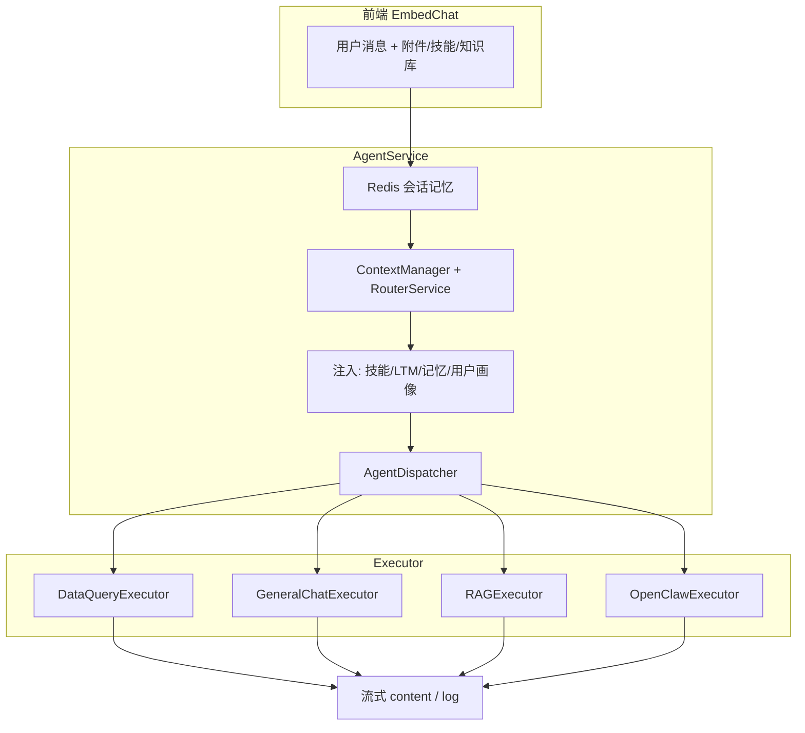
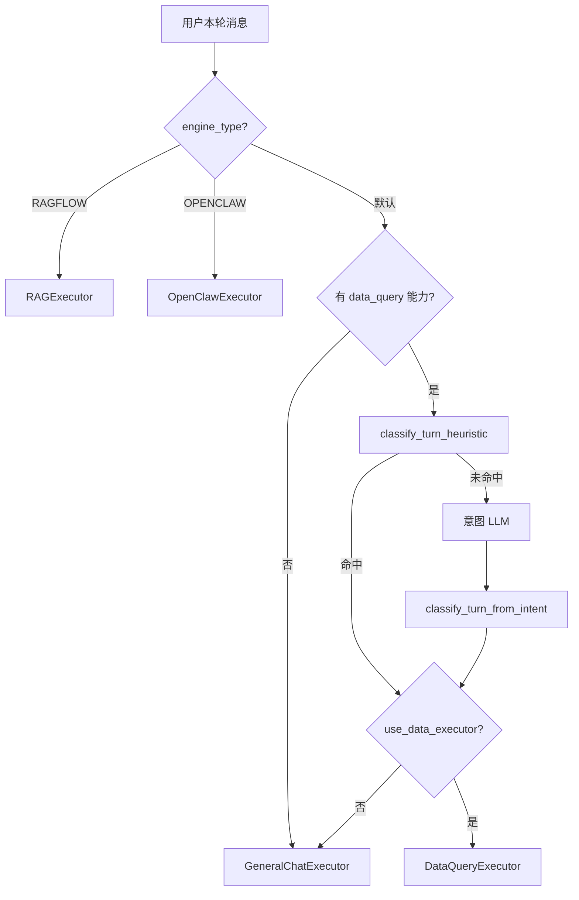

# 智能体执行流程架构评审

> 文档日期：2026-05-30  
> 范围：EmbedChat → AgentService → Dispatcher → Executors（Data / GeneralChat / RAG / OpenClaw）  
> 关联改动：`turn_classifier.py`、Dispatcher 统一路由、DataExecutor 经验库裁剪、RAG conversation_id 修复

---

## 1. 智能体执行流程总览



**一轮请求的主路径**：Redis 读历史 → 路由选智能体 → 注入上下文 → **Dispatcher 选 Executor** → ReAct/合成 → 写回 Redis + Trace。

K1/K2/K3、技能自动加载、SQL 错误判定，主要落在 **TurnClassification + DataQueryExecutor + intent 启发式** 这一层。

---

## 2. 轮次分类模型（K1 / K2 / K3）

| 类型 | 含义 | 典型用户说法 | Executor | 经验库 | 查库护栏 |
|------|------|--------------|----------|--------|----------|
| **K1** | 新查数 | 「查用户列表」「查 PUE 并可视化」 | DataQuery | ✓ | ✓ |
| **K2** | 复用上一轮结果 | 「画个柱状图」「分析一下刚才的结果」 | DataQuery | ✗ | ✗ |
| **K3** | 对已有上下文做动作 | 「保存这个结果」「导出上面表格」 | GeneralChat | ✗ | ✗ |
| **技能执行** | 显式使用技能 | 「使用用户列表查询技能」 | DataQuery | ✓ | 按技能 |
| **元操作** | 创建/保存技能 | 「把流程保存为技能」 | GeneralChat | ✗ | ✗ |
| **KNOWLEDGE** | 知识库/SOP | 「处理流程是什么」 | GeneralChat | ✗ | ✗（强制 search_knowledge_base） |
| **GENERAL** | 闲聊/通用 | 「你好」 | GeneralChat | ✗ | ✗ |

\* KNOWLEDGE_BASE 意图走 GeneralChat，并在 Step 1 强制 `search_knowledge_base`（P1 已落地）。

### 分类流程（优化后）



**实现位置**：`app/services/ai/turn_classifier.py` + `app/services/ai/dispatcher.py`

---

## 3. Dispatcher（路由层）

### 优化前问题

1. **分类逻辑分散**：Dispatcher 只有 meta-action / K2 两条短路；K3、技能执行、复合 K1 在 DataExecutor 内部才处理。
2. **`KNOWLEDGE_BASE` 无专门路由**：意图有该类型，但一律 GeneralChat。
3. **K3 / 技能未在 Dispatcher 短路**：路径绕、步骤多、难观测。
4. **意图日志只覆盖 DataQuery**：GeneralChat 分支无统一「本轮类型」日志。

### 优化后（P0 已落地）

| 条件 | 去向 |
|------|------|
| `engine_type=RAGFLOW` | RAGExecutor |
| `engine_type=OPENCLAW` | OpenClawExecutor |
| 无 `data_query` 能力 | GeneralChatExecutor |
| `TurnType.META_ACTION` | GeneralChatExecutor |
| `TurnType.K3_CONTEXT_ACTION` | GeneralChatExecutor |
| `TurnType.SKILL_EXECUTION` | DataQueryExecutor（跳过意图 LLM） |
| `TurnType.K2_REUSE_RESULT` + 有缓存 | DataQueryExecutor（跳过意图 LLM） |
| `TurnType.K1` 复合句启发式 | DataQueryExecutor（跳过意图 LLM） |
| 意图 LLM → DATA_QUERY | DataQueryExecutor |
| 其余 | GeneralChatExecutor |

AgentService 统一输出 **「轮次分类」** 日志（含 K3 / GENERAL / KNOWLEDGE 路径）。

---

## 4. DataQueryExecutor（ChatBI 核心）

### 做得好的

- K1/K2/K3 护栏 + DB 提示词对齐（V69）
- 技能自动注入 + `MUST_LOAD_SKILL_FIRST`
- `_analyze_result` 增强，避免 SQL 报错误走 fast-path
- K2 纯加工 vs「查数+可视化」复合句区分
- 非数据工具 / 元操作放行
- 经验库、比率异常复核、SQL plan 等高风险保护

### P0 已优化

- **非 K1 跳过经验库检索**：通过 `turn_classification.requires_few_shot` / `_skip_few_shot` 控制，K2 在入口即合成返回，K3 已改走 GeneralChat。

### 仍可优化（P1/P2）

| 问题 | 建议 |
|------|------|
| ReAct 步数 + 多层护栏叠加 | 按 TurnClassification 进一步裁剪步骤上限 |
| 与 GeneralChat 大量重复代码 | 抽到 `executors/common.py` |
| 合成阶段与 ReAct 双 LLM | K1 简单结果允许最后一轮 thought 直出（可选） |
| `_sql_plan_enforcement_added` 挂实例 | 每轮 `execute()` 内 reset |

---

## 5. GeneralChatExecutor

### 特点

- 系统隐式工具（create_skills、memory_search、任务等）——**元操作、K3 保存、技能的正确归宿**
- ReAct + 最终合成；Step 1 无工具时可直出
- memory_search 强制拦截（跨会话回忆）

### 问题与建议（P1）

1. 未继承 `BaseExecutor`，trace 风格略异 → 继承并对齐。
2. Step 1 直出可能跳过应先调的工具 → 对技能执行模式加强提示。
3. 与 DataExecutor 重复的 history/附件转换 ~150 行 → 抽取 common。

---

## 6. RAGExecutor

### P0 已修复

- **`conversation_id=self.conversation_id or self.trace_id`**：与 OpenClaw 一致，RAGFlow 多轮会话与平台 conversation 对齐。

### 仍可优化（P2）

- 去掉或缩短 `asyncio.sleep(0.5)` UX 延迟
- 清理重复 import
- 日志文案改为「连接 RAGFlow…」，避免假装本地 NLP

---

## 7. OpenClawExecutor

- 输入/输出安全审计（额外 LLM）
- 正确使用 `conversation_id` 作 session
- 注入用户可访问 RAG 数据集权限

**可优化**：安全审计与主调用串行 → 轻量规则前置 + 仅高风险走 LLM（P2）。

---

## 8. AgentService 编排层

### 做得好的

- 技能挂载 + 口头技能名自动解析
- LTM / 跨会话记忆 / Active Memory 预加载
- 多智能体并行（secondary_agents）
- 权限校验、审计、会话摘要

### P0/P1 优化

| 点 | 状态 |
|----|------|
| 技能已加载时省略 discovery hint | ✓ 已做 |
| 统一「轮次分类」日志 | ✓ 已做 |
| 按 Turn 类型裁剪 prompt 注入块 | P1 待做 |
| 多智能体与 Turn 分类脱节 | P1 待做 |

---

## 9. 跨 Executor 对比

```text
┌─────────────────┬──────────────┬──────────────┬─────────────┐
│                 │ DataQuery    │ GeneralChat  │ RAG/OpenClaw│
├─────────────────┼──────────────┼──────────────┼─────────────┤
│ BaseExecutor    │ ✓            │ ✗            │ ✓           │
│ 系统隐式工具    │ ✓            │ ✓            │ N/A         │
│ Turn 分类       │ ✓（Dispatcher│ ✓（Dispatcher│ ✗           │
│                 │  注入）      │  注入）      │             │
│ 工具错误分析    │ 强           │ 弱/分散      │ 远程        │
│ 历史/附件转换   │ 重复实现     │ 重复实现     │ 简单        │
│ MAX_STEPS 默认  │ 6            │ 5            │ -           │
└─────────────────┴──────────────┴──────────────┴─────────────┘
```

---

## 10. 优化优先级

### P0（已落地）

1. 统一 `TurnClassification`，Dispatcher 一次判定  
2. DataExecutor：非 K1 跳过经验库检索  
3. Dispatcher：K3 / 技能 / meta 明确路由 + 统一 trace log  
4. RAGExecutor：`conversation_id` 修复  

### P1（已全部落地）

5. 抽取 `executors/common.py` — ✓  
6. GeneralChat 继承 BaseExecutor — ✓  
7. KNOWLEDGE_BASE 强制 `search_knowledge_base` — ✓  
8. AgentService 按 Turn 裁剪 LTM / memory / active memory / **用户画像** — ✓  
9. 多智能体共享 `session_turn`（避免 N 次意图 LLM） — ✓  
10. KNOWLEDGE 启发式短路 — ✓  

### P2（部分落地）

- 前端按 Turn 类型折叠「深度思考」步骤 — ✓  
- DataExecutor 简单成功结果减少双轮 LLM — 未做  
- RAG 去掉 0.5s sleep — 未做  
- OpenClaw 安全审计分层 — 未做  

---

## 11. 总结

**整体架构清晰**：AgentService 编排 → Dispatcher 分流 → 四类 Executor；ChatBI 主链已从「机械流水线」演进为「按轮次类型裁剪」。

**主要短板（已部分收敛）**：

1. 「这轮是什么类型」曾散落在 Dispatcher、Intent LLM、DataExecutor、DB 提示词四处 —— 现已集中到 `turn_classifier`。  
2. DataQuery 与 GeneralChat 职责边界 —— K3 / meta 已明确走 GeneralChat。  
3. RAG 会话 ID —— 已修复。

**下一步建议（P1）**：抽取 Executor 公共模块 + KNOWLEDGE_BASE 专门路由。
